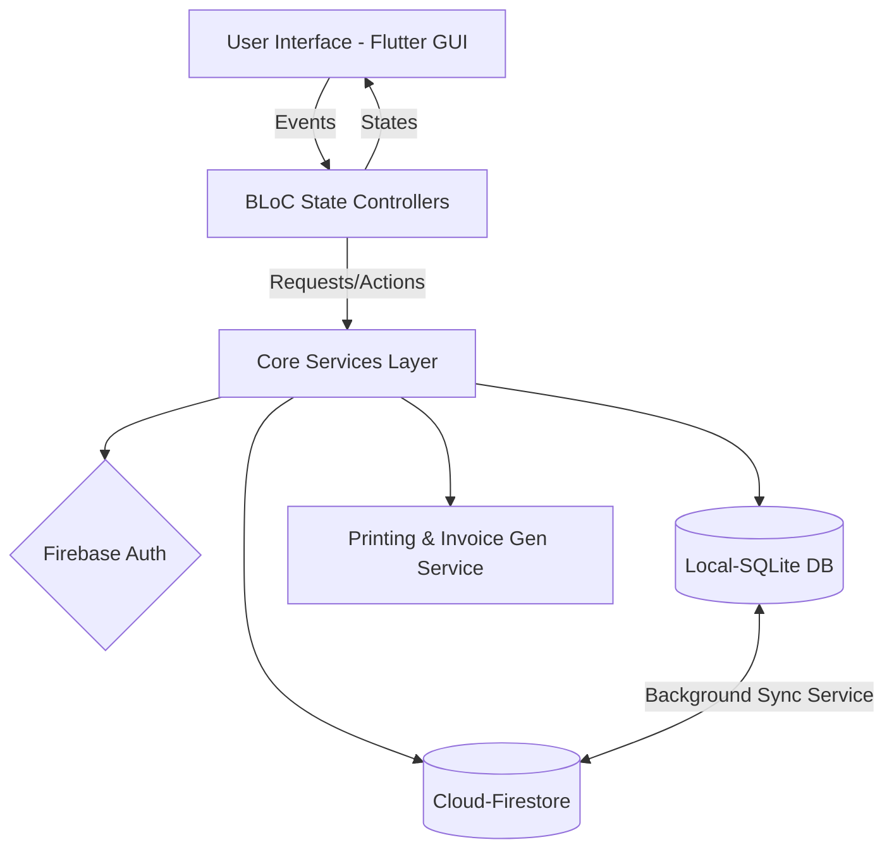
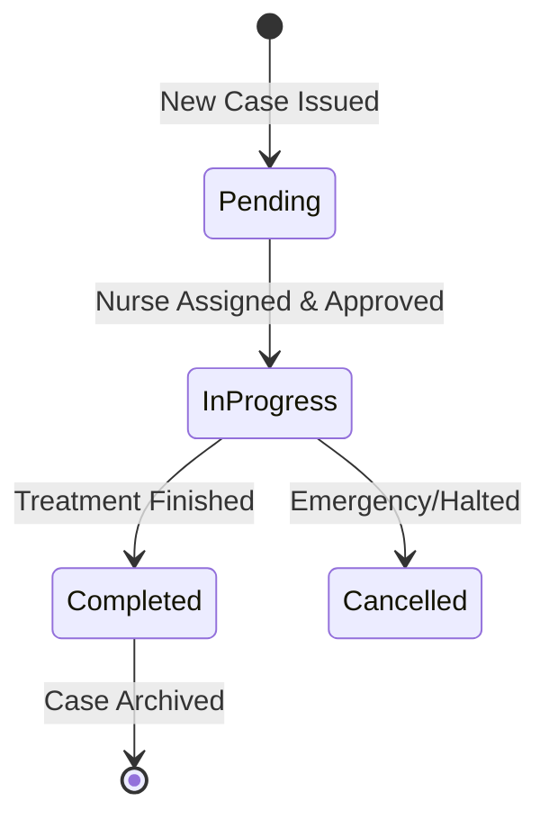
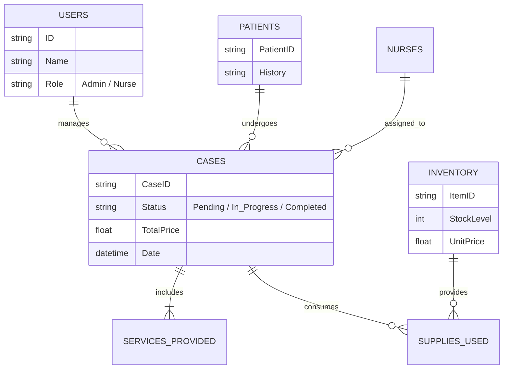

<div align="center">


# 🏥 New Care Desktop Management System

**A Comprehensive Enterprise-grade Desktop Application Built with Flutter for Nursing & Health Care Centers**

[](https://flutter.dev)
[](https://firebase.google.com)
[](https://sqlite.org)
[](#)
[](#)

</div>

<br/>

## 📝 Project Overview

**New Care** is a massive Desktop application engineered with Flutter. Designed entirely around nursing centers and home healthcare providers, the system features a fluid, highly-responsive **RTL (Right-to-Left)** Arabic interface layout. It provides immense resilience by coupling fast **local execution storage (SQLite)** with dynamic **secure cloud storage (Firebase Firestore/Auth)** ensuring synchronized workflows whether your center is heavily internet-reliant or experiencing network downtimes.

<br/>

## 📐 System Architecture

This project is deeply rooted in **Clean Architecture** patterns utilizing a **Feature-Driven** module structure ensuring high code cohesion and minimal coupling. State management is efficiently controlled via the **BLoC / Cubit Pattern**.



<br/>

## ✨ Core Modules & Features

### 1. 👥 Complete Patient Portfolio Management
Maintains accurate digital medical records keeping all visits, prescriptions, and history interconnected. Enables real-time global search indexing.

### 2. 🩺 Tracking Operations & Automated Workflows


### 3. 📦 Granular Inventory Tracking
- Real-time logging of supplies.
- Computes margins & cost per item accurately.
- Visual alerts triggering upon low-stock thresholds.

### 4. 🔐 Enhanced Role-Based Security Rules
Firebase Firestore rules mapped efficiently against Auth Tokens. Ensures zero cross-contamination of permissions between layers.
- **Super Administrator:** Absolute authorization & remote kill-switches.
- **Center Administrator:** Main hub driver. Regulates workflow and financial reporting.
- **Nurse/Operative:** View/update only specifically assigned workloads and case tracking.

<br/>

## 🗄️ Database Schema & Object Relations



<br/>

## 📊 Analytics & Reporting
An insightful Dashboard visualizing performance efficiently. Data flows synchronously representing a 360-view into:
- Overall center earnings and net revenue.
- Bar Charts monitoring high traffic days vs low traffic days.
- Pie Charts distributing ongoing statuses for optimal operation execution.

<br/>

## 🚀 Getting Started

### Prerequisites
1. Installed **Flutter SDK** environment variables.
2. Initialized Desktop Build Systems (Visual Studio for Windows or Xcode for MacOS).
3. Pre-configured Firebase cloud project matching your bundle identifiers.

### Environment Setup Instructions

1. **Clone the Repository:**
   ```bash
   git clone https://github.com/Desha29/new_care.git
   cd new_care
   ```

2. **Acquire Pub Dependencies:**
   ```bash
   flutter pub get
   ```

3. **Database Rules Configuration:**
   Inject the robust rules built inside `firestore.rules` script seamlessly into your Google Firebase backend.

4. **Run Application natively:**
   ```bash
   flutter run -d windows
   ```

<br/>

---

<div align="center">
<b>Developed with ❤️ to empower Healthcare Professionals!</b>
</div>