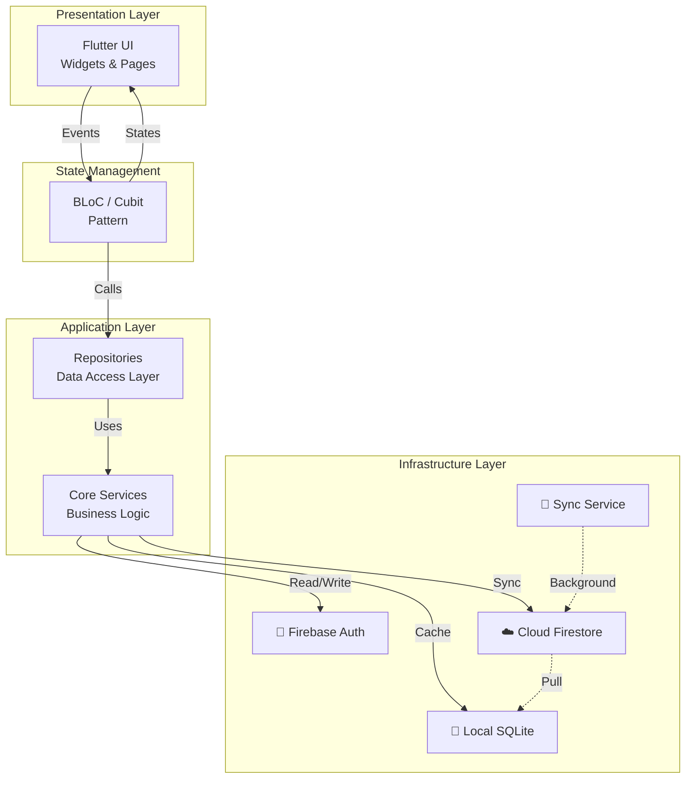
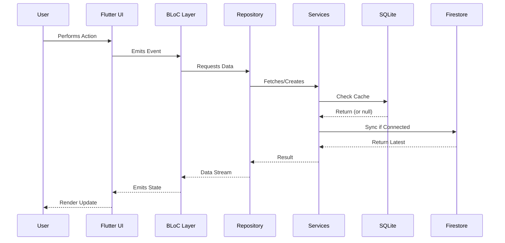
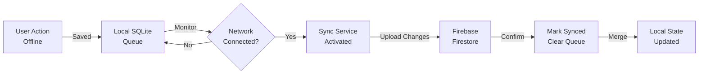
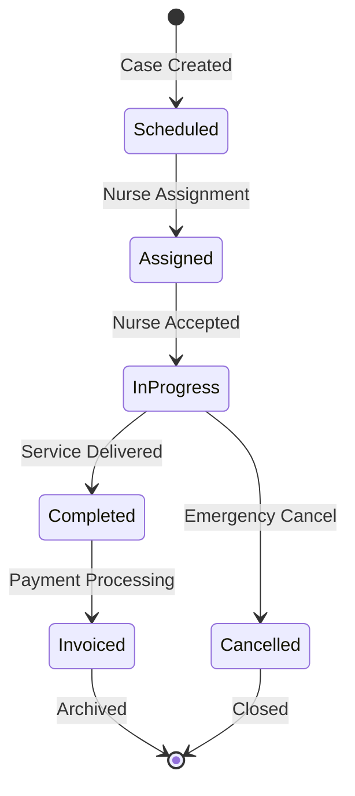
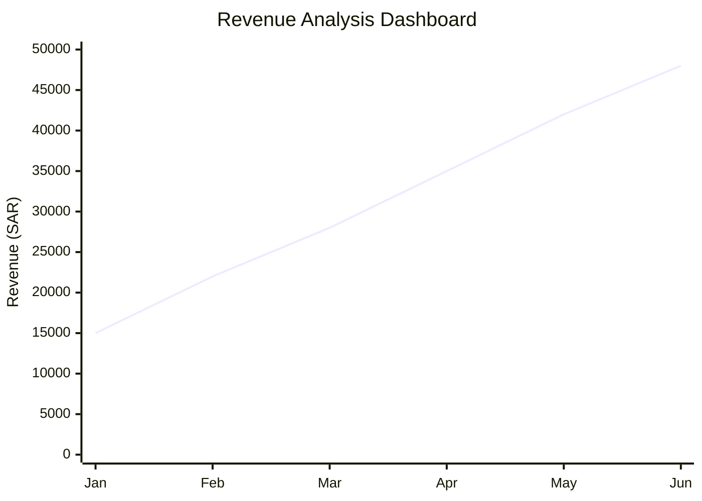
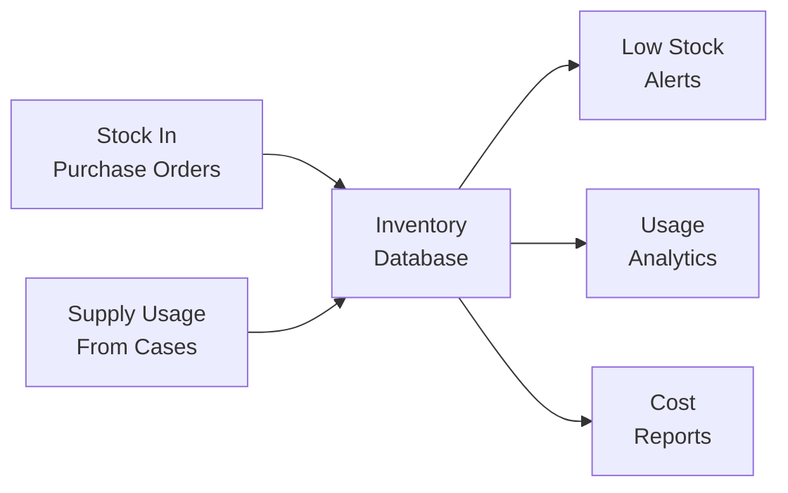
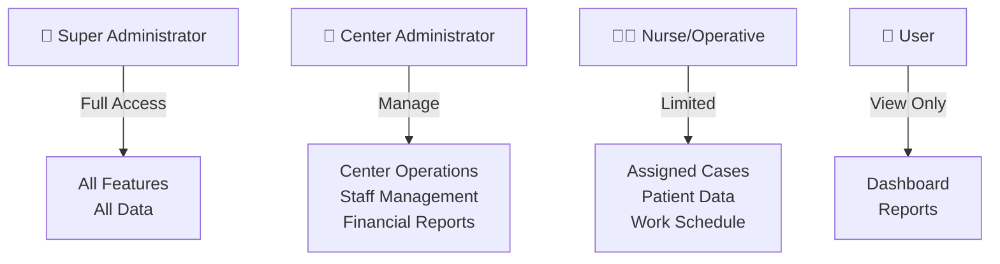
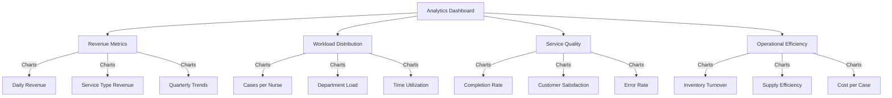
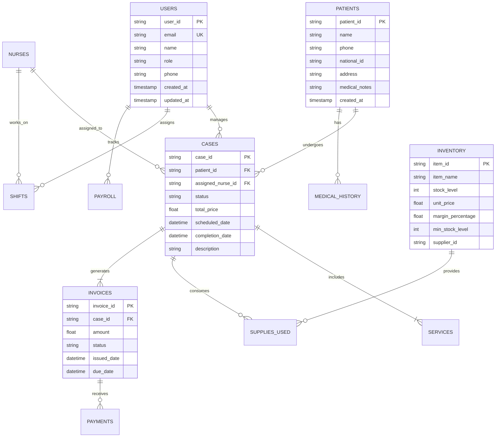
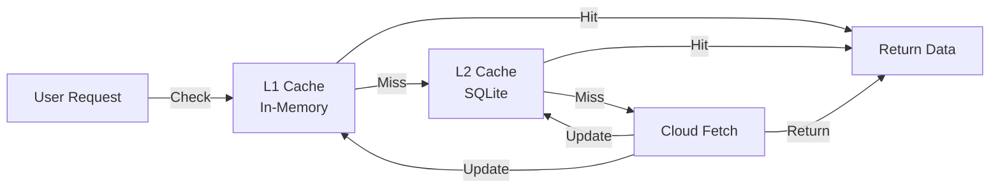

<div align="center">


# 🏥 New Care Healthcare Management System

**Enterprise-Grade Desktop Application for Healthcare Center Operations**

A comprehensive, production-ready management platform built with Flutter, designed specifically for nursing centers and home healthcare providers. Features real-time synchronization, offline-first architecture, and Arabic RTL support.

[](https://flutter.dev)
[](https://firebase.google.com)
[](https://sqlite.org)
[](#)
[](#)
[](#)

</div>

<br/>

## � Table of Contents
- [Project Overview](#-project-overview)
- [System Architecture](#-system-architecture)
- [Core Features](#-core-features)
- [Database Design](#-database-design)
- [Module Structure](#-module-structure)
- [Technology Stack](#-technology-stack)
- [Getting Started](#-getting-started)
- [Configuration](#-configuration)
- [Security](#-security)
- [Contributing](#-contributing)
- [Support & License](#-support--license)

<br/>

## 📝 Project Overview

**New Care** is an enterprise-grade healthcare management solution engineered for modern nursing centers and home healthcare providers. The platform delivers:

- **Offline-First Architecture:** Local SQLite database ensures operations continue seamlessly during network interruptions
- **Real-Time Synchronization:** Automatic cloud sync with Firebase Firestore when connectivity is restored
- **Internationalization:** Full Arabic RTL (Right-to-Left) language support with responsive UI design
- **Role-Based Access Control:** Granular permission management for administrators, nurses, and operational staff
- **Comprehensive Audit Trail:** Complete logging of all transactions and user activities

The system follows **Clean Architecture** principles with **Feature-Driven** module organization, ensuring maintainability, scalability, and testability across the codebase.

<br/>

## 🏗️ System Architecture

### Architecture Layers


```mermaid
graph TB
    subgraph "Presentation Layer"
        UI[Flutter UI<br/>Widgets & Pages]
    end
    
    subgraph "State Management"
        Bloc["BLoC / Cubit<br/>Pattern"]
    end
    
    subgraph "Application Layer"
        Repos["Repositories<br/>Data Access Layer"]
        Services["Core Services<br/>Business Logic"]
    end
    
    subgraph "Infrastructure Layer"
        FireAuth["🔐 Firebase Auth"]
        Firestore["☁️ Cloud Firestore"]
        SQLite["💾 Local SQLite"]
        Sync["🔄 Sync Service"]
    end
    
    UI -->|Events| Bloc
    Bloc -->|States| UI
    Bloc -->|Calls| Repos
    Repos -->|Uses| Services
    Services -->|Read/Write| FireAuth
    Services -->|Sync| Firestore
    Services -->|Cache| SQLite
    Sync -.->|Background| Firestore
    Firestore -.->|Pull| SQLite
```

### Data Flow Architecture


```mermaid
sequenceDiagram
    participant User as User
    participant UI as Flutter UI
    participant Bloc as BLoC Layer
    participant Repo as Repository
    participant Service as Services
    participant Local as SQLite
    participant Cloud as Firestore
    
    User ->> UI: Performs Action
    UI ->> Bloc: Emits Event
    Bloc ->> Repo: Requests Data
    Repo ->> Service: Fetches/Creates
    Service ->> Local: Check Cache
    Local -->> Service: Return (or null)
    Service ->> Cloud: Sync if Connected
    Cloud -->> Service: Return Latest
    Service -->> Repo: Result
    Repo -->> Bloc: Data Stream
    Bloc -->> UI: Emits State
    UI -->> User: Render Update
```

### Offline-First Sync Strategy


```mermaid
graph LR
    A["User Action<br/>Offline"] -->|Saved| B["Local SQLite<br/>Queue"]
    B -->|Monitor| C{"Network<br/>Connected?"}
    C -->|No| B
    C -->|Yes| D["Sync Service<br/>Activated"]
    D -->|Upload Changes| E["Firebase<br/>Firestore"]
    E -->|Confirm| F["Mark Synced<br/>Clear Queue"]
    F -->|Merge| G["Local State<br/>Updated"]
```

<br/>

## ✨ Core Features

### 1. 👥 Patient Management System
Complete digital patient portfolio with comprehensive medical history tracking.

**Features:**
- Centralized patient profiles with demographics and medical history
- Real-time visit logging and prescription tracking
- Global search indexing for quick patient lookup
- Automated compliance documentation
- Patient communication timeline

### 2. 🩺 Case & Appointment Management


```mermaid
stateDiagram-v2
    [*] --> Scheduled: Case Created
    Scheduled --> Assigned: Nurse Assignment
    Assigned --> InProgress: Nurse Accepted
    InProgress --> Completed: Service Delivered
    InProgress --> Cancelled: Emergency Cancel
    Completed --> Invoiced: Payment Processing
    Invoiced --> [*]: Archived
    Cancelled --> [*]: Closed
```

**Workflow Automation:**
- Intelligent case assignment based on nurse availability
- Real-time status tracking and notifications
- Automated reminder system for upcoming appointments
- Case completion with service documentation
- Dispute resolution workflow

### 3. 📊 Financial & Invoicing System


```mermaid
xychart-beta
    title "Revenue Analysis Dashboard"
    x-axis [Jan, Feb, Mar, Apr, May, Jun]
    y-axis "Revenue (SAR)" 0 --> 50000
    line [15000, 22000, 28000, 35000, 42000, 48000]
```

**Capabilities:**
- Automatic invoice generation from completed cases
- Multiple payment method tracking
- Financial reporting and analytics
- Revenue forecasting
- Tax compliance documentation

### 4. 📦 Inventory Management


```mermaid
graph LR
    A["Stock In<br/>Purchase Orders"] --> B["Inventory<br/>Database"]
    C["Supply Usage<br/>From Cases"] --> B
    B --> D["Low Stock<br/>Alerts"]
    B --> E["Usage<br/>Analytics"]
    B --> F["Cost<br/>Reports"]
```

**Features:**
- Real-time stock tracking per item
- Automated low-stock alerts and reordering
- Cost per item calculation with margins
- Supply usage analytics
- Batch and expiration date tracking
- Supplier management

### 5. 👨‍💼 Payroll & HR Management
- Employee scheduling and shift management
- Attendance tracking
- Payroll calculation with deductions
- Performance reviews
- Leave management

### 6. 🔐 Role-Based Access Control


```mermaid
graph TB
    Admin["🔑 Super Administrator"]
    CAdmin["👔 Center Administrator"]
    Nurse["👩‍⚕️ Nurse/Operative"]
    User["👤 User"]
    
    Admin -->|Full Access| System["All Features<br/>All Data"]
    CAdmin -->|Manage| Center["Center Operations<br/>Staff Management<br/>Financial Reports"]
    Nurse -->|Limited| Cases["Assigned Cases<br/>Patient Data<br/>Work Schedule"]
    User -->|View Only| Dashboard["Dashboard<br/>Reports"]
```

**Security Model:**
- **Super Administrator:** System-wide access, configuration, remote management
- **Center Administrator:** Center operations, staff management, financial oversight
- **Nursing Staff:** Case assignments, patient care documentation, schedule management
- **Support Staff:** Limited data access for administrative tasks

### 7. 📈 Analytics & Reporting Dashboard


```mermaid
graph TB
    Dashboard["Analytics Dashboard"]
    
    Dashboard --> Revenue["Revenue Metrics"]
    Dashboard --> Workload["Workload Distribution"]
    Dashboard --> Quality["Service Quality"]
    Dashboard --> Operations["Operational Efficiency"]
    
    Revenue -->|Charts| Rev1["Daily Revenue"]
    Revenue -->|Charts| Rev2["Service Type Revenue"]
    Revenue -->|Charts| Rev3["Quarterly Trends"]
    
    Workload -->|Charts| Work1["Cases per Nurse"]
    Workload -->|Charts| Work2["Department Load"]
    Workload -->|Charts| Work3["Time Utilization"]
    
    Quality -->|Charts| Qual1["Completion Rate"]
    Quality -->|Charts| Qual2["Customer Satisfaction"]
    Quality -->|Charts| Qual3["Error Rate"]
    
    Operations -->|Charts| Ops1["Inventory Turnover"]
    Operations -->|Charts| Ops2["Supply Efficiency"]
    Operations -->|Charts| Ops3["Cost per Case"]
```

<br/>

## 🗄️ Database Schema & Design

### Entity Relationship Diagram


```mermaid
erDiagram
    USERS ||--o{ CASES : manages
    USERS ||--o{ SHIFTS : assigns
    USERS ||--o{ PAYROLL : tracks
    PATIENTS ||--o{ CASES : undergoes
    PATIENTS ||--o{ MEDICAL_HISTORY : has
    NURSES ||--o{ CASES : "assigned_to"
    NURSES ||--o{ SHIFTS : "works_on"
    CASES ||--|{ SERVICES : includes
    CASES ||--o{ SUPPLIES_USED : consumes
    CASES ||--|{ INVOICES : generates
    INVENTORY ||--o{ SUPPLIES_USED : provides
    INVOICES ||--o{ PAYMENTS : receives
    
    USERS {
        string user_id PK
        string email UK
        string name
        string role
        string phone
        timestamp created_at
        timestamp updated_at
    }
    
    PATIENTS {
        string patient_id PK
        string name
        string phone
        string national_id
        string address
        string medical_notes
        timestamp created_at
    }
    
    CASES {
        string case_id PK
        string patient_id FK
        string assigned_nurse_id FK
        string status
        float total_price
        datetime scheduled_date
        datetime completion_date
        string description
    }
    
    INVENTORY {
        string item_id PK
        string item_name
        int stock_level
        float unit_price
        float margin_percentage
        int min_stock_level
        string supplier_id
    }
    
    INVOICES {
        string invoice_id PK
        string case_id FK
        float amount
        string status
        datetime issued_date
        datetime due_date
    }
```

### Data Persistence Strategy

| Layer | Storage | Purpose | Sync Frequency |
|-------|---------|---------|-----------------|
| **Offline Cache** | SQLite (Local) | Instant read/write, no latency | Real-time |
| **Cloud Sync** | Firestore | Backup, multi-device sync, audit trail | When connected |
| **Authentication** | Firebase Auth | User identity & session management | Real-time |
| **Analytics** | Firestore Analytics | Performance metrics & reporting | Batch (hourly) |

<br/>

## � Module Structure

The project follows **Feature-Driven Architecture** with clear separation of concerns:

```
lib/
├── core/                          # Shared utilities and infrastructure
│   ├── constants/                 # App-wide constants
│   ├── di/                        # Dependency Injection setup
│   ├── enums/                     # Shared enumerations
│   ├── error/                     # Error handling & exceptions
│   ├── logic/                     # Core business logic
│   ├── services/                  # Firebase, Database services
│   ├── utils/                     # Helper utilities
│   ├── widgets/                   # Reusable widgets
│   └── app_bloc_observer.dart     # BLoC observer for debugging
│
├── features/                      # Feature modules (Feature-Driven)
│   ├── activity_logs/            # Activity logging
│   ├── attendance/               # Attendance tracking
│   ├── auth/                     # Authentication & authorization
│   ├── cases/                    # Case management
│   ├── dashboard/                # Analytics dashboard
│   ├── financials/               # Financial operations
│   ├── inventory/                # Inventory management
│   ├── invoice/                  # Invoice generation
│   ├── payroll/                  # Payroll management
│   ├── procedures/               # Procedure templates
│   ├── reports/                  # Reporting engine
│   ├── settings/                 # Application settings
│   ├── shifts/                   # Shift management
│   └── users/                    # User management
│
├── app.dart                       # App configuration & routing
├── firebase_options.dart          # Firebase setup
└── main.dart                      # Entry point

# Each feature module typically contains:
features/[feature_name]/
├── data/
│   ├── datasources/              # API & local data sources
│   ├── models/                   # Data models
│   └── repositories/             # Repository implementations
├── domain/
│   ├── entities/                 # Business entities
│   ├── repositories/             # Repository interfaces
│   └── usecases/                 # Business logic use cases
└── presentation/
    ├── bloc/                     # BLoC state management
    ├── pages/                    # Full page screens
    ├── widgets/                  # Feature-specific widgets
    └── routes/                   # Feature routes
```

<br/>

## 🛠️ Technology Stack

### Frontend & UI
- **Flutter 3.38+** - Multi-platform UI framework
- **Material Design 3** - UI/UX components
- **Bloc/Cubit** - State management
- **GetIt** - Dependency injection

### Backend & Data
- **Firebase Authentication** - User authentication
- **Firestore** - Cloud database
- **SQLite** - Local offline-first storage
- **Firebase Cloud Functions** - Serverless backend

### Development Tools
- **Dart 3.0+** - Programming language
- **VS Code / Android Studio** - IDE
- **Git** - Version control
- **Melos** - Monorepo management (if applicable)

### Testing & Quality
- **Flutter Test** - Unit & widget tests
- **Mockito** - Mock objects
- **Bloc Test** - BLoC testing
- **Integration Test** - End-to-end testing

<br/>

## �🚀 Getting Started

### Prerequisites

Ensure you have the following installed and configured:

- **Flutter SDK** (v3.38+) - [Installation Guide](https://flutter.dev/docs/get-started/install)
- **Dart SDK** (v3.0+) - Included with Flutter
- **Git** - For version control
- **Visual Studio** (2019+) or **Visual Studio Build Tools** - For Windows desktop development
- **Android Studio** or **Xcode** - For iOS/Android emulation (optional)

### Environment Setup Instructions

**Step 1: Clone the Repository**
```bash
git clone https://github.com/Desha29/new_care.git
cd new_care
```

**Step 2: Install Flutter Dependencies**
```bash
flutter pub get
```

**Step 3: Download Custom Fonts** (Optional)
```bash
dart download_fonts.dart
```

**Step 4: Configure Firebase**

1. Visit [Firebase Console](https://console.firebase.google.com/)
2. Create or select your project
3. Enable Firebase services:
   - **Authentication:** Enable Email/Password and Google Sign-in
   - **Firestore Database:** Create in production mode with rules from `firestore.rules`
   - **Storage:** Enable for document uploads
4. Download `google-services.json` and place in `android/app/`
5. Download `GoogleService-Info.plist` and place in `ios/Runner/`

**Step 5: Configure Firestore Rules**

Apply security rules from `firestore.rules`:
```bash
firebase deploy --only firestore:rules
```

**Step 6: Run the Application**

For **Windows Desktop:**
```bash
flutter run -d windows
```

For **Android Emulator:**
```bash
flutter run -d emulator-5554
```

For **iOS Simulator:**
```bash
flutter run -d iPhone
```

<br/>

## ⚙️ Configuration

### Firebase Configuration Files

The project requires Firebase configuration files for proper operation:

- `google-services.json` - Android Firebase configuration
- `GoogleService-Info.plist` - iOS Firebase configuration
- `firestore.rules` - Firestore security rules
- `firebase.json` - Firebase project configuration

All are included in the repository for development purposes.

### Environment Variables

Create a `.env` file in the project root (optional):
```
FIREBASE_PROJECT_ID=your-project-id
FIREBASE_API_KEY=your-api-key
FIREBASE_REGION=us-central1
APP_NAME=New Care
DEBUG_MODE=false
```

### Feature Toggles

Configure features in `lib/core/constants/feature_flags.dart`:
```dart
class FeatureFlags {
  static const bool enableOfflineMode = true;
  static const bool enableAnalytics = true;
  static const bool enableExperimentalFeatures = false;
}
```

<br/>

## 🔐 Security

### Authentication & Authorization

- **Firebase Auth Integration:** Secure user authentication with email/password and social logins
- **JWT Token Validation:** Server-side token verification for API requests
- **Role-Based Access Control (RBAC):** Fine-grained permission management
- **Encrypted Local Storage:** Sensitive data encrypted in SQLite using `flutter_secure_storage`

### Firestore Security Rules

```javascript
rules_version = '2';
service cloud.firestore {
  match /databases/{database}/documents {
    
    // Admin access
    match /{document=**} {
      allow read, write: if request.auth.token.role == 'admin';
    }
    
    // User-specific access
    match /users/{userId}/{document=**} {
      allow read, write: if request.auth.uid == userId;
    }
    
    // Case access (nurses can view assigned cases)
    match /cases/{caseId} {
      allow read: if resource.data.assigned_nurse_id == request.auth.uid;
      allow write: if request.auth.token.role in ['admin', 'nurse'];
    }
  }
}
```

### Data Privacy

- **GDPR Compliance:** Patient data handling follows GDPR guidelines
- **Audit Logging:** All data modifications logged with timestamps and user IDs
- **Data Encryption:** Sensitive data encrypted at rest and in transit
- **Secure Deletion:** Automatic data purging for deleted records after retention period

<br/>

## 📊 Performance Optimization

### Caching Strategy


```mermaid
graph LR
    Request["User Request"]
    Request -->|Check| L1["L1 Cache<br/>In-Memory"]
    L1 -->|Hit| Response["Return Data"]
    L1 -->|Miss| L2["L2 Cache<br/>SQLite"]
    L2 -->|Hit| Response
    L2 -->|Miss| Cloud["Cloud Fetch"]
    Cloud -->|Update| L2
    Cloud -->|Update| L1
    Cloud -->|Return| Response
```

### Database Indexing

Key indexes for optimal performance:

```javascript
// Firestore Indexes
db.collection('cases').orderBy('status').orderBy('created_at')
db.collection('patients').where('center_id').orderBy('name')
db.collection('invoices').where('status').orderBy('created_date')
db.collection('inventory').where('stock_level').orderBy('min_stock_level')
```

### UI Performance

- **Lazy Loading:** Large lists use `ListView.builder` for memory efficiency
- **Image Optimization:** All images compressed and cached
- **Widget Rebuild Optimization:** BLoC selectors prevent unnecessary rebuilds
- **Code Splitting:** Feature modules loaded on-demand<br/>

## 🧪 Testing

### Running Tests

**Unit Tests:**
```bash
flutter test
```

**Widget Tests:**
```bash
flutter test test/widget_test.dart
```

**Integration Tests:**
```bash
flutter test integration_test/
```

**Test Coverage:**
```bash
flutter test --coverage
lcov --list coverage/lcov.info
```

### Test Strategy

- **Unit Tests:** Test business logic and utilities
- **Widget Tests:** Test individual widgets and interactions
- **Integration Tests:** Test complete user flows
- **BLoC Tests:** Test state changes and event handling

<br/>

## 📦 Deployment

### Building for Release

**Windows Desktop:**
```bash
flutter build windows --release
```

Output: `build/windows/runner/Release/new_care.exe`

**Android APK:**
```bash
flutter build apk --release
```

**iOS App:**
```bash
flutter build ios --release
```

### Release Checklist

- [ ] Update version in `pubspec.yaml`
- [ ] Update `CHANGELOG.md` with changes
- [ ] Run all tests and verify passing
- [ ] Build for all target platforms
- [ ] Test on actual devices
- [ ] Create GitHub release tag
- [ ] Generate release notes
- [ ] Notify stakeholders

### Continuous Integration/Deployment

The project uses GitHub Actions for automated:
- Code linting and formatting
- Unit and widget test execution
- Build artifact generation
- Release automation

<br/>

## 🐛 Troubleshooting

### Common Issues

**Issue: "Flutter not found"**
```bash
# Verify Flutter installation
flutter --version

# Add Flutter to PATH if needed
export PATH="$PATH:/path/to/flutter/bin"
```

**Issue: "Firestore connection timeout"**
- Check internet connectivity
- Verify Firebase project configuration
- Review Firestore rules for permission errors
- Check Firebase console for service status

**Issue: "SQLite database locked"**
- Close all instances of the app
- Delete SQLite database from app storage
- Restart application for fresh sync

**Issue: "BLoC state not updating"**
- Verify BLoC observers in `app_bloc_observer.dart`
- Check for missing `yield` or `emit()` statements
- Ensure proper event dispatching
- Review BLoC test outputs

### Debug Mode

Run with debug logging:
```bash
flutter run --verbose
```

Enable Firebase emulator for local testing:
```bash
firebase emulators:start
```

<br/>

## 📚 Documentation

- **[API Documentation](docs/API.md)** - REST API endpoints and usage
- **[Database Schema](docs/DATABASE.md)** - Detailed schema documentation
- **[Feature Guides](docs/FEATURES.md)** - User guides for each feature
- **[Developer Guide](docs/DEVELOPER.md)** - Development best practices
- **[Architecture Decisions](docs/ADR.md)** - Architecture Decision Records

<br/>

## 🤝 Contributing

We welcome contributions! Please follow these guidelines:

1. **Fork the Repository**
   ```bash
   git clone https://github.com/YOUR_USERNAME/new_care.git
   cd new_care
   ```

2. **Create Feature Branch**
   ```bash
   git checkout -b feature/your-feature-name
   ```

3. **Follow Code Standards**
   - Run `flutter format lib/` before committing
   - Run `flutter analyze` to check for issues
   - Write meaningful commit messages
   - Add tests for new features

4. **Commit Changes**
   ```bash
   git add .
   git commit -m "feat: add new feature description"
   ```

5. **Push and Create Pull Request**
   ```bash
   git push origin feature/your-feature-name
   ```

### Code Style Guidelines

- Use **Effective Dart** conventions
- Follow **BLoC pattern** for state management
- Keep methods small and focused (single responsibility)
- Write self-documenting code with clear naming
- Add comments for complex logic
- Use **const** constructors where possible

### Commit Message Format

```
<type>(<scope>): <subject>

<body>

<footer>
```

**Types:** `feat`, `fix`, `docs`, `style`, `refactor`, `test`, `chore`

**Example:**
```
feat(cases): add case assignment notification

- Implement real-time notifications for case assignments
- Add email notification service integration
- Update case repository with new methods

Closes #123
```

<br/>

## 📞 Support & License

### Getting Help

- **Documentation:** Check the [docs](docs/) directory
- **Issues:** Report bugs on [GitHub Issues](https://github.com/Desha29/new_care/issues)
- **Discussions:** Join [GitHub Discussions](https://github.com/Desha29/new_care/discussions)
- **Email:** support@newcare.example.com

### License

This project is licensed under the **MIT License** - see the [LICENSE](LICENSE) file for details.

```
MIT License

Copyright (c) 2024 New Care Healthcare Solutions

Permission is hereby granted, free of charge, to any person obtaining a copy
of this software and associated documentation files (the "Software"), to deal
in the Software without restriction, including without limitation the rights
to use, copy, modify, merge, publish, distribute, sublicense, and/or sell
copies of the Software, and to permit persons to whom the Software is
furnished to do so, subject to the following conditions:

The above copyright notice and this permission notice shall be included in all
copies or substantial portions of the Software.
```

### Citation

If you use New Care in your research or project, please cite:

```bibtex
@software{newcare2024,
  author = {Desha29},
  title = {New Care: Enterprise Healthcare Management System},
  year = {2024},
  url = {https://github.com/Desha29/new_care}
}
```

<br/>

## 🌟 Acknowledgments

- Flutter team for the excellent framework
- Firebase for backend infrastructure
- Community contributors and testers
- Healthcare professionals for requirements and feedback

<br/>

---

<div align="center">

### 💼 Built with ❤️ for Healthcare Professionals

**Supporting Global Healthcare Excellence**

[⬆ Back to top](#-new-care-healthcare-management-system)

</div>